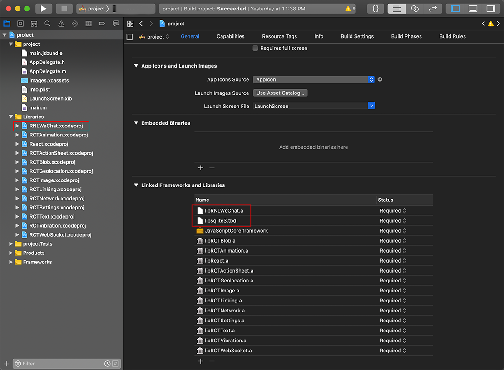
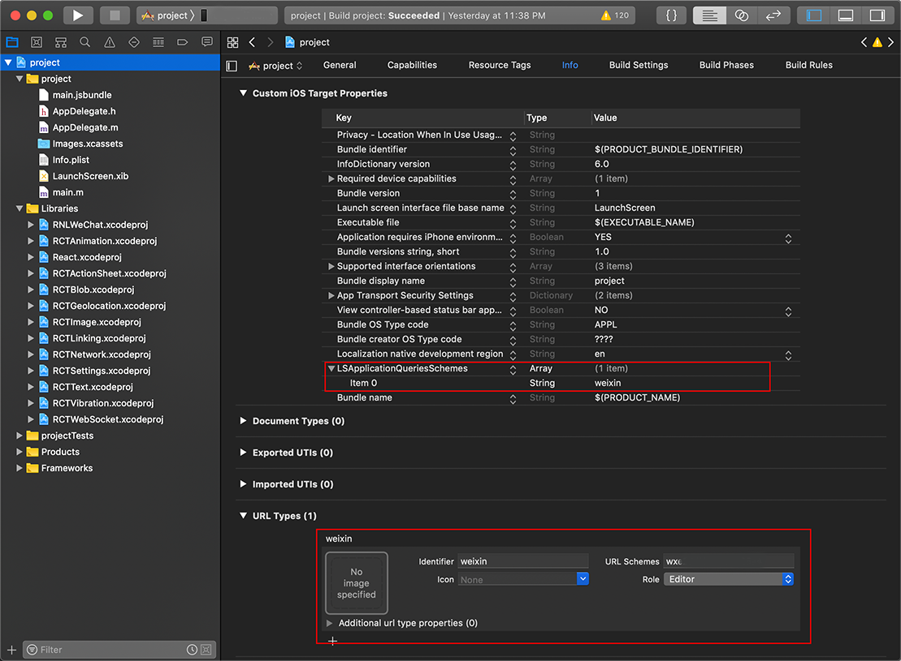
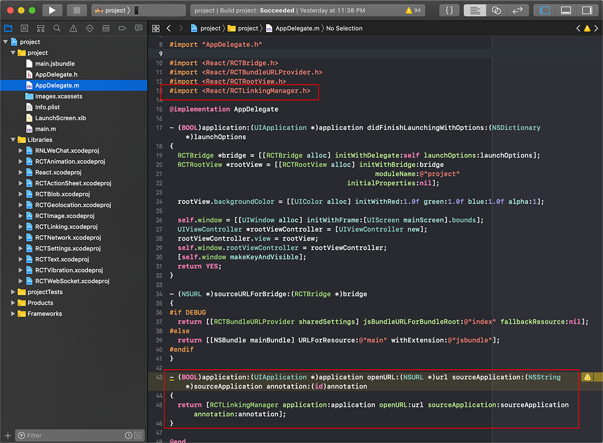
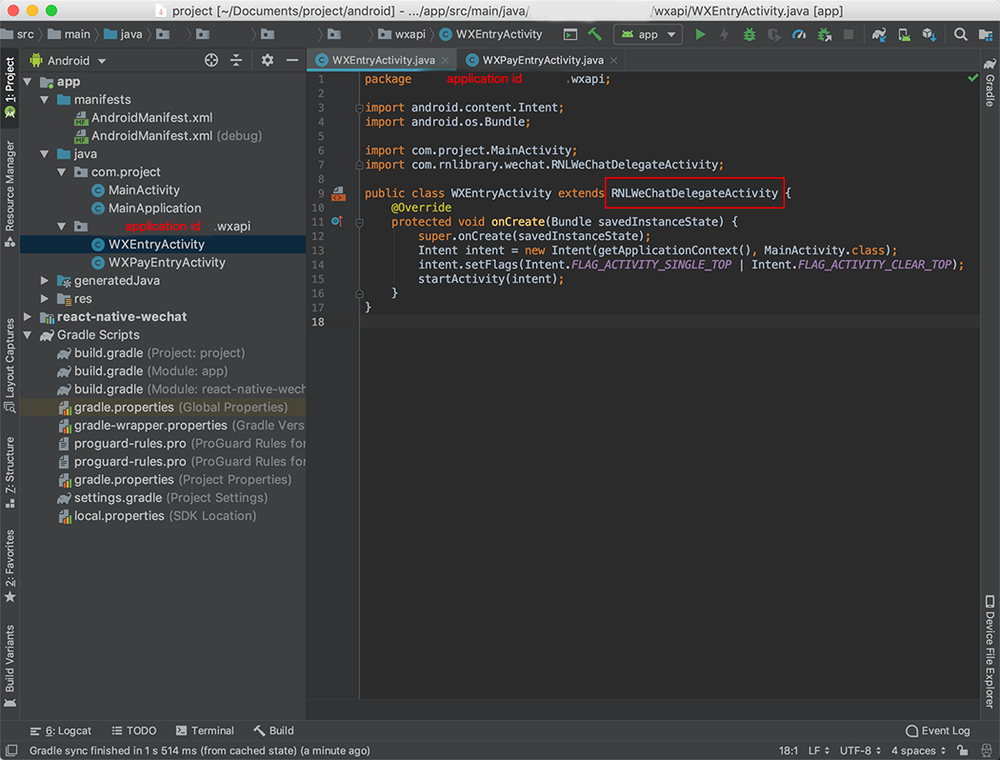
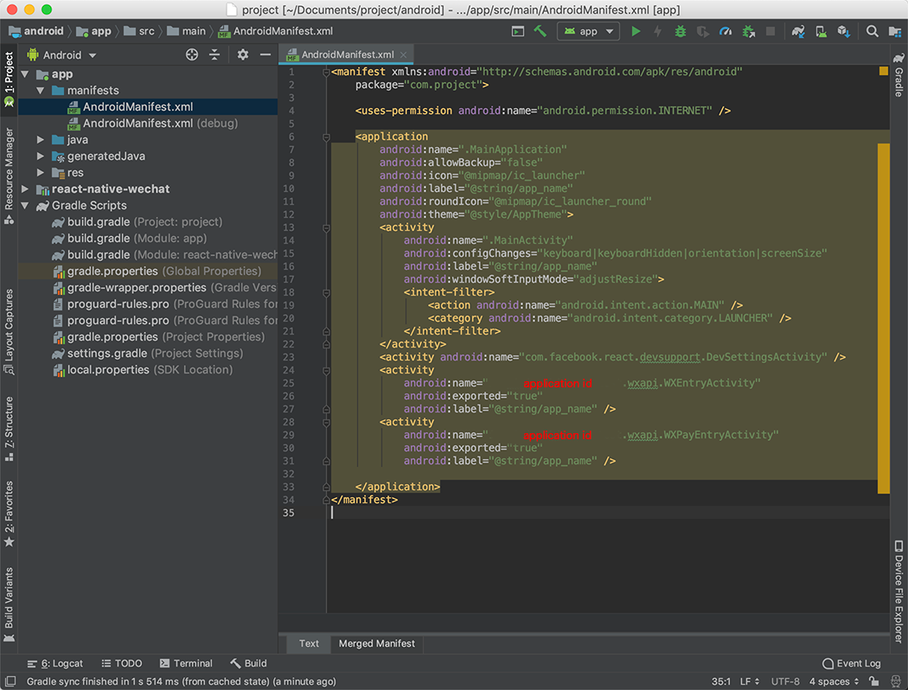

# react-native-wechat

[WeChat SDK](https://open.weixin.qq.com/cgi-bin/showdocument?action=dir_list) [](https://www.npmjs.com/package/@pencilcool/react-native-wechat) [](https://travis-ci.org/pencilcool/react-native-wechat)

**SDK Version**
iOS 1.8.4
Android 5.3.1

**Environment**
Xcode 10.2.1
react-native 0.59.5

## [Example](example/App.js)

## Getting Started

```bash
yarn add @pencilcool/react-native-wechat
# or
npm i @pencilcool/react-native-wechat --save
```

```bash
react-native link @pencilcool/react-native-wechat
```

### iOS

#### 1. add dependence

```txt
// Copy this
libsqlite3.tbd
```



#### 2. add configuration

```txt
// Copy this
LSApplicationQueriesSchemes
weixin
```



#### 3. add code

```objective-c
#import <React/RCTLinkingManager.h>

- (BOOL)application:(UIApplication *)application openURL:(NSURL *)url sourceApplication:(NSString *)sourceApplication annotation:(id)annotation
{
  return [RCTLinkingManager application:application openURL:url sourceApplication:sourceApplication annotation:annotation];
}
```



### Android

#### 1. add activity

```txt
// Copy this
WXEntryActivity
WXPayEntryActivity // content is same as WXEntryActivity
```

```java
package [application id].wxapi;

import android.content.Intent;
import android.os.Bundle;

import com.project.MainActivity;
import com.rnlibrary.wechat.RNLWeChatDelegateActivity;

public class WXEntryActivity extends RNLWeChatDelegateActivity {
    @Override
    protected void onCreate(Bundle savedInstanceState) {
        super.onCreate(savedInstanceState);
        Intent intent = new Intent(getApplicationContext(), MainActivity.class);
        intent.setFlags(Intent.FLAG_ACTIVITY_SINGLE_TOP | Intent.FLAG_ACTIVITY_CLEAR_TOP);
        startActivity(intent);
    }
}
```



#### 2. register activity

```xml
<activity
    android:name="[applicaton id].wxapi.WXEntryActivity"
    android:exported="true"
    android:label="@string/app_name" />
<activity
    android:name="[applicaton id].wxapi.WXPayEntryActivity"
    android:exported="true"
    android:label="@string/app_name" />
```



#### 2. add sign

```txt
// Copy this
storeFile file(YOUR_STORE_FILE)
storePassword YOUR_STORE_PASSWORD
keyAlias YOUR_KEY_ALIAS
keyPassword YOUR_KEY_PASSWORD
signingConfig signingConfigs.type
```

```bash
# https://open.weixin.qq.com/cgi-bin/showdocument?action=dir_list&t=resource/res_list&verify=1&id=open1419318060
# WeChat requires keystore signature md5
keytool -list -v -keystore [[path/file.keystore]] | grep MD5 | { read s; echo "${s//:/}" } | tr '[:upper:]' '[:lower:]'
```


## API

```typescript
import * as RNWechat from "@pencilcool/react-native-wechat";

interface IInitializeOption {
  appID: string;
  debug?: boolean;
}
RNWechat.initialize({
  appID: "",
  debug: true,
});

RNWechat.isAppInstalled();

RNWechat.getAppInstallUrl();

RNWechat.isSupportOpenApi();

RNWechat.getSDKVersion();

interface IAuthOption {
  state: string;
  scope?: AuthScope;
  fallback?: boolean;
}
RNWechat.auth({
  state: "",
  scope: RNWechat.AuthScope.UserInfo,
  fallback: true,
});

interface IPayOption {
  partnerId: string;
  prepayId: string;
  nonce: string;
  timestamp: number;
  package: string;
  sign: string;
}
RNWechat.pay({
  partnerId: "",
  prepayId: "",
  nonce: "",
  timestamp: 0,
  package: "",
  sign: "",
});

RNWechat.offlinePay();

interface INontaxPayOption {
  url: string;
}
RNWechat.nontaxPay({ url: "" });

interface IPayInsuranceOption {
  url: string;
}
RNWechat.payInsurance({ url: "" });

RNWechat.openRankList();

interface IOpenWebViewOption {
  url: string;
}
RNWechat.openWebView({ url: "" });

interface IOpenBusinessViewOption {
  type: string;
  query: string;
  ext?: string;
}
RNWechat.openBusinessView({
  type: "",
  query: "",
  ext: "",
});

interface IOpenBusinessWebViewOption {
  type: string;
  query: {
    [key: string]: any;
  };
}
RNWechat.openBusinessWebView({
  type: 0,
  query: {},
});

interface ICardItem {
  id: string;
  ext: string;
}
RNWechat.addCard({
  cards: [{ id: "", ext: "" }],
});

interface IChooseCardOption {
  appID?: string;
  shopID?: number;
  multiSelect?: boolean;
  cardType?: string;
  cardTpID?: string;
  signType?: string;
  cardSign?: string;
  timestamp?: number;
  nonce?: string;
}
RNWechat.chooseCard({
  appID: "",
  shopID: 0,
  multiSelect: true,
  cardType: "",
  cardTpID: "",
  signType: "",
  cardSign: "",
  timestamp: 0,
  nonce: "",
});

interface IChooseInvoiceOption {
  appID?: string;
  shopID?: number;
  signType?: string;
  cardSign?: string;
  timestamp?: number;
  nonce?: string;
}
RNWechat.chooseInvoice({
  appID: "",
  shopID: 0,
  signType: "",
  cardSign: "",
  timestamp: 0,
  nonce: "",
});

interface IInvoiceAuthInsertOption {
  url: string;
}
RNWechat.invoiceAuthInsert({ url: "" });

interface ILaunchMiniProgramOption {
  username: string;
  type: number;
  path?: string;
  ext?: string;
}
RNWechat.launchMiniProgram({
  username: "",
  type: RNWechat.MiniProgramType.Test,
  path: "",
  ext: "",
});

interface ISubscribeMiniProgramMessageOption {
  appID: string;
}
RNWechat.subscribeMiniProgramMessage({ appID: "" });

enum MessageType {
  Text = 0,
  Image = 1,
  Music = 2,
  Video = 3,
  File = 4,
  Webpage = 5,
  MiniProgram = 6,
  AppExtend = 7,
  Emoticon = 8,
  Location = 9,
}

enum MessageScene {
  // 聊天
  Session = 0,
  // 朋友圈
  Timeline = 1,
  // 收藏
  Favorite = 2,
  // 指定联系人
  SpecifiedSession = 3,
}

interface ITextMediaMessage extends IBaseMediaMessage {
  content: string;
}
RNWechat.sendMessage({
  scene: RNWechat.MessageScene.Session,
  messageType: RNWechat.MessageType.Text,
  content: "",
});

interface IImageMediaMessage extends IBaseMediaMessage {
  image: string;
}
RNWechat.sendMessage({
  scene: RNWechat.MessageScene.Session,
  messageType: RNWechat.MessageType.Image,
  image: "",
});

interface IMusicMediaMessage extends IBaseMediaMessage {
  url: string;
  lowBandURL: string;
  dataURL: string;
  lowBandDataURL: string;
}
RNWechat.sendMessage({
  scene: RNWechat.MessageScene.Session,
  messageType: RNWechat.MessageType.Music,
  messageTitle: "",
  messageDesc: "",
  messageThumb: "",
  url: "",
  lowBandURL: "",
  dataURL: "",
  lowBandDataURL: "",
});

interface IVideoMediaMessage extends IBaseMediaMessage {
  url: string;
  lowBandURL: string;
}
RNWechat.sendMessage({
  scene: RNWechat.MessageScene.Session,
  messageType: RNWechat.MessageType.Video,
  messageTitle: "",
  messageDesc: "",
  messageThumb: "",
  url: "",
  lowBandURL: "",
});

interface IFileMediaMessage extends IBaseMediaMessage {
  file: string;
  ext: string;
}
RNWechat.sendMessage({
  scene: RNWechat.MessageScene.Session,
  messageType: RNWechat.MessageType.File,
  messageTitle: "",
  file: "",
  ext: "",
});

interface IWebpageMediaMessage extends IBaseMediaMessage {
  url: string;
}
RNWechat.sendMessage({
  scene: RNWechat.MessageScene.Session,
  messageType: RNWechat.MessageType.Webpage,
  messageTitle: "",
  messageDesc: "",
  messageThumb: "",
  url: "",
});

enum MiniProgramType {
  // 正式版
  Release = 0,
  // 开发版
  Test = 1,
  // 体验版
  Preview = 2,
}

interface IMiniProgramMediaMessage extends IBaseMediaMessage {
  type: MiniProgramType;
  username: string;
  path?: string;
  hdImage?: string;
  url?: string;
  shareTicket?: boolean;
}
RNWechat.sendMessage({
  scene: RNWechat.MessageScene.Session,
  messageType: RNWechat.MessageType.MiniProgram,
  type: RNWechat.MiniProgramType.Test,
  username: "",
  messageTitle: "",
  hdImage: "",
  path: "",
  url: "",
  messageDesc: "",
  messageThumb: "",
  shareTicket: false,
});

interface IAppExtendMediaMessage extends IBaseMediaMessage {
  url: string;
  ext: string;
  file: string;
}
RNWechat.sendMessage({
  scene: RNWechat.MessageScene.Session,
  messageType: RNWechat.MessageType.AppExtend,
  messageTitle: "",
  messageDesc: "",
  url: "",
  ext: "",
  file: "",
  messageThumb: "",
  messageTag: "",
  messageExt: "",
  messageAction: "",
});

interface IEmoticonMediaMessage extends IBaseMediaMessage {
  image: string;
}
RNWechat.sendMessage({
  scene: RNWechat.MessageScene.Session,
  messageType: RNWechat.MessageType.Emoticon,
  image: "",
});

interface ILocationMediaMessage extends IBaseMediaMessage {
  lng: number;
  lat: number;
}
RNWechat.sendMessage({
  scene: RNWechat.MessageScene.Session,
  messageType: RNWechat.MessageType.Location,
  lng: 0,
  lat: 0,
  messageTitle: "",
  messageDesc: "",
});

interface ISubscribeMessageOption {
  scene: MessageScene;
  templateID: string;
  reserved?: string;
}
RNWechat.subscribeMessage({
  scene: RNWechat.MessageScene.Session,
  templateID: "",
  reserved: "",
});

enum WeChatRequestType {
  GetMessage = 0,
  ShowMessage = 1,
  LaunchFromWX = 2,
}
interface IWeChatRequestData {
  requestType: WeChatRequestType;
  type: number;
  openID: string;
  lang: string;
  country: string;
  result: IMediaMessage;
}
RNWechat.listenRequest((data) => {});
```
